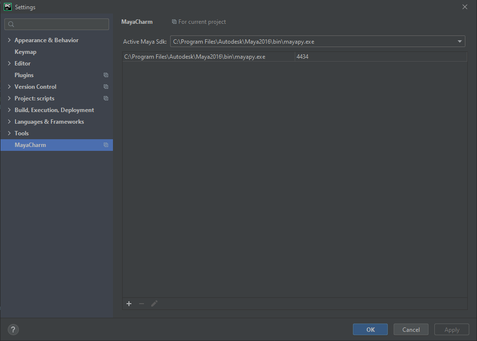
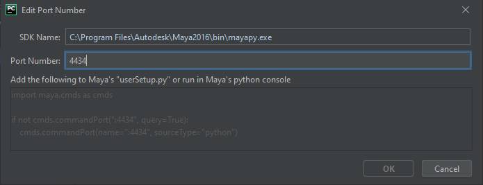
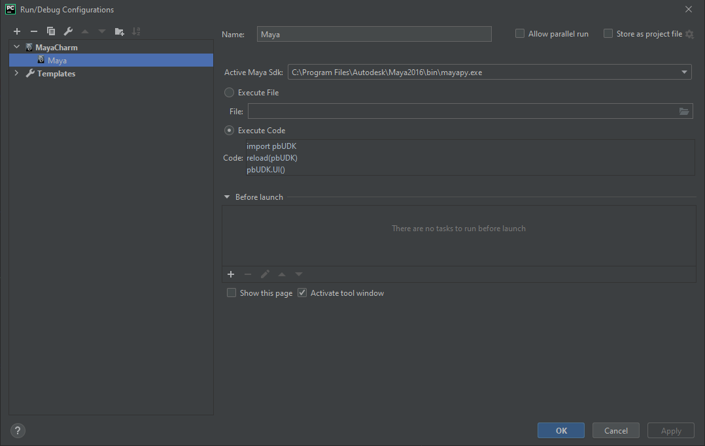
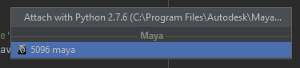

# MayaCharm
Maya integration with run and debug configurations for Maya. MayaCharm lets you execute the current document or
arbitrary code as if it was in Maya from PyCharm. For users of the professional version of PyCharm it will also setup
and connect the pydev debugger to Maya as well.

For those simply just wanting the compiled version, you are best to just search for it, in the plugin repository of PyCharm.
https://plugins.jetbrains.com/plugin/8218?pr=pycharm

## Installation 
It requires some minimal setup. The settings panel is in `Settings > Other Settings > MayaCharm` here you can define what port numbers
MayaCharm will talk to your Maya installs on. This is where you also define the default Maya install that the `Execute Documeant In Maya` and `Execute Selection in Maya` actions will be performed on. Currently MayaCharm looks for any `mayapy` interpters you have setup, and uses those to define where your Maya installs are. 
These can be added and removed from the `Project Interpreter` section of the settings panel.

When you edit a port number MayaCharm will also display what code you either need to execute in maya 
or add to your usersetup.py to open maya up to connections from MayaCharm.

## Usage
Once the plugin is installed and setup MayaCharm will be displayed as a type of run configuration. You just need to tell it what Maya instance to connect to, and provide either a python file or some code to be excuted on run. Both running and debugging is supported this way.

There is also a Execute Selection and a Execute Document actions in the run menu, that can also be accessed via alt+s and alt+a.
If you just want to attach to a existing Maya process you can use the `Attach to Process` option in the `Run` menu and Maya instances will now show up in these menu as well as regular python instances.

